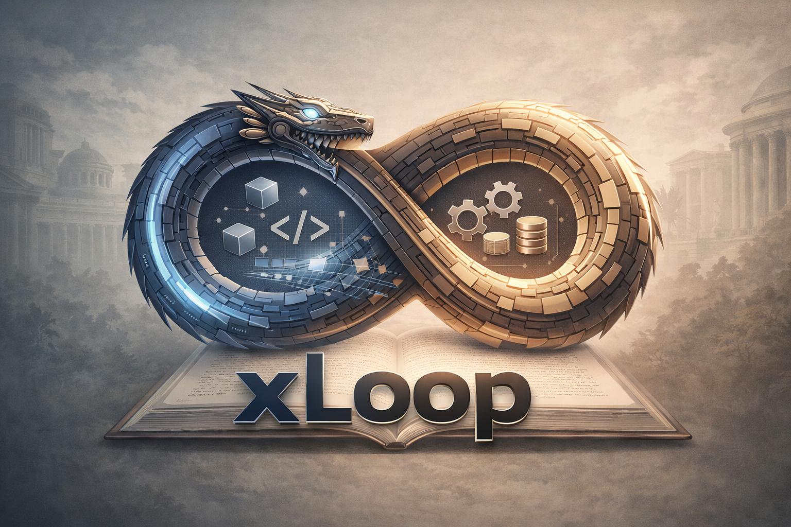

<h1 align="center">xLoop</h1>

<p align="center">
  <strong>eXpert Loop Claude Harness</strong><br>
  멀티소스 리서치를 자동화하는 Claude Code 하네스
</p>

<p align="center">
  
  
  
</p>

<p align="center">
  
</p>

<p align="center">
  <a href="./README.md">English</a> | <strong>한국어</strong>
</p>

---

xLoop은 YouTube, 웹, arXiv, Reddit/HN에서 검색하고, NotebookLM으로 심층 분석한 뒤, 갭을 찾아 반복 검색하는 **Expert Loop** 파이프라인을 제공합니다.

## 핵심 컨셉

```
검색 → 소스 수집 → NotebookLM 분석 → 갭 탐지 → 재검색 → ... → 최종 보고서
```

Expert Loop는 한 번의 검색으로 끝내지 않습니다. AI가 분석 결과에서 **빠진 관점(갭)**을 찾아내고, 갭 유형에 맞는 최적 소스에서 재검색하여 주제를 점진적으로 깊게 커버합니다.

## 설치

```bash
cd xLoop
bash setup.sh
notebooklm login  # Google 계정 인증
```

setup.sh가 수행하는 작업:
1. Python 의존성 설치 (`requirements.txt`)
2. yt-dlp 설치 확인
3. Playwright Chromium 설치 (NotebookLM용)
4. NotebookLM 인증 안내
5. NotebookLM 스킬 설치
6. 슬래시 커맨드를 `.claude/commands/`에 심링크

## 요구사항

- Python 3.11+
- [yt-dlp](https://github.com/yt-dlp/yt-dlp) — YouTube 검색
- [notebooklm-py](https://github.com/nichochar/notebooklm-py) — NotebookLM 연동
- [Playwright](https://playwright.dev/) — 브라우저 자동화
- [duckduckgo-search](https://github.com/deedy5/duckduckgo_search) — 웹 검색
- [arxiv](https://github.com/lukasschwab/arxiv.py) — arXiv 논문 검색

## 사용법

### Expert Loop (전체 파이프라인)

```
/expert-loop "AI agents" --max-iterations 3
```

세션 생성 → 멀티소스 검색 → NotebookLM 분석 → 갭 탐지 → 재검색 반복 → 최종 보고서 → 작업 카드 도출까지 자동으로 진행합니다.

### 개별 커맨드

| 커맨드 | 설명 | 예시 |
|--------|------|------|
| `/yt-search` | YouTube 영상 검색 | `/yt-search "transformer" --count 5` |
| `/web-search` | 웹 검색 (DuckDuckGo) | `/web-search "AI framework" --time w` |
| `/arxiv-search` | arXiv 논문 검색 | `/arxiv-search "attention mechanism" --sort date` |
| `/community-search` | Reddit & HN 검색 | `/community-search all "LLM deploy" --min-score 50` |
| `/notebooklm-add` | NotebookLM에 소스 추가 | `/notebooklm-add "리서치" URL1 URL2` |
| `/notebooklm-ask` | NotebookLM에 질문 | `/notebooklm-ask <notebook_id> "핵심 요약"` |
| `/research` | 리서치 세션 관리 | `/research` |

### 세션 관리

| 커맨드 | 설명 |
|--------|------|
| `/session-new` | 새 리서치 세션 생성 |
| `/session-list` | 세션 목록 조회 |
| `/session-resume` | 기존 세션 이어하기 |
| `/session-summary` | 세션 요약 보기 |

## 검색 옵션

### yt-search

| 플래그 | 기본값 | 설명 |
|--------|--------|------|
| `--count N` | 20 | 결과 수 |
| `--months N` | 6 | 최근 N개월 필터 |
| `--no-date-filter` | - | 전체 기간 |
| `--min-views N` | 0 | 최소 조회수 |
| `--min-duration M` | 0 | 최소 길이 (분) |
| `--max-duration M` | 0 | 최대 길이 (분) |
| `--channel NAME` | - | 특정 채널만 |
| `--json` | - | JSON 출력 |

### web-search

| 플래그 | 기본값 | 설명 |
|--------|--------|------|
| `--count N` | 10 | 결과 수 |
| `--time d\|w\|m\|y` | - | 기간 필터 |
| `--json` | - | JSON 출력 |

### arxiv-search

| 플래그 | 기본값 | 설명 |
|--------|--------|------|
| `--count N` | 10 | 결과 수 |
| `--sort` | relevance | `relevance` 또는 `date` |
| `--json` | - | JSON 출력 |

### community-search

| 플래그 | 기본값 | 설명 |
|--------|--------|------|
| 플랫폼 | (필수) | `reddit`, `hn`, `all` |
| `--count N` | 10 | 결과 수 |
| `--subreddit NAME` | - | 서브레딧 지정 |
| `--min-score N` | 0 | 최소 점수 |
| `--time d\|w\|m\|y` | year | 기간 필터 |
| `--json` | - | JSON 출력 |

## Expert Loop 동작 원리

```
Step 0: 세션 생성 + 루프 초기화
    │
    ▼
┌─── 루프 시작 ──────────────────────────┐
│                                         │
│  Step 1: 멀티소스 검색 + 소스 수집       │
│    → YouTube / Web / arXiv / Community  │
│    → 사용자가 결과 선택                  │
│    → NotebookLM에 추가                  │
│                                         │
│  Step 2: NotebookLM 심층 분석           │
│    → 핵심 개념, 접근법, 트레이드오프     │
│                                         │
│  Step 3: 갭 분석 + 소스 매칭            │
│    → 분석축: 이론/실전, 찬반, 기초/심화  │
│    → 갭 유형별 최적 소스 추천            │
│    → 새 검색 쿼리 생성                  │
│                                         │
│  Step 4: 종료 판단                      │
│    → 최대 반복 도달 or 갭 없음 → 종료   │
│    → 갭 남음 → Step 1로 반복            │
│                                         │
└─────────────────────────────────────────┘
    │
    ▼
Step 5: 최종 분석 종합
Step 6: 리서치 보고서 생성
Step 7: 작업 카드 도출 (→ GitHub Issues)
```

### 갭→소스 매칭 전략

| 갭 유형 | 추천 소스 | 이유 |
|---------|----------|------|
| 이론/학술/증명 | arXiv | 논문이 가장 정확 |
| 실전/구현/튜토리얼 | YouTube | 시각적 설명, 코드 워크스루 |
| 비교/의견/경험 | Community | 현업 개발자 토론 |
| 최신 동향/공식 문서 | Web | 블로그, 공식 문서 |

## 프로젝트 구조

```
xLoop/
├── commands/              ← Claude Code 슬래시 커맨드 (13개)
│   ├── expert-loop.md     ← 핵심: Expert Loop 오케스트레이션
│   ├── yt-search.md
│   ├── web-search.md
│   ├── arxiv-search.md
│   ├── community-search.md
│   ├── notebooklm-add.md
│   ├── notebooklm-ask.md
│   ├── research.md
│   ├── session-new.md
│   ├── session-list.md
│   ├── session-resume.md
│   └── session-summary.md
├── scripts/               ← Python 검색·분석 스크립트
│   ├── loop_engine.py     ← 루프 상태 관리 (시작/반복/종료/체크)
│   ├── session_manager.py ← 세션 CRUD + 검색/소스/질문 기록
│   ├── yt_search.py       ← YouTube 검색 (yt-dlp)
│   ├── web_search.py      ← 웹 검색 (DuckDuckGo)
│   ├── arxiv_search.py    ← arXiv 논문 검색
│   ├── community_search.py← Reddit & Hacker News 검색
│   ├── notebooklm_add.py  ← NotebookLM 노트북 생성 + 소스 추가
│   └── notebooklm_ask.py  ← NotebookLM 질문/답변
├── tests/                 ← pytest 테스트
├── data/sessions/         ← 세션 데이터 (JSON)
├── assets/                ← 이미지 등 정적 리소스
├── requirements.txt
├── setup.sh
└── README.md
```

## 개발

```bash
cd xLoop
pytest                     # 테스트 실행
ruff check .               # 린트
ruff format .              # 포맷팅
```

## 라이선스

MIT
